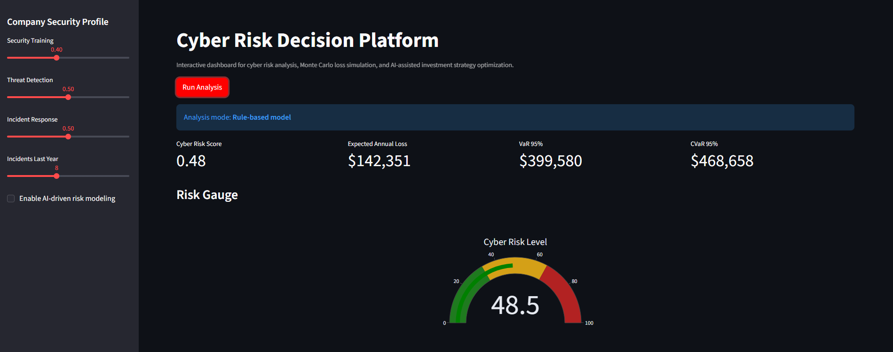
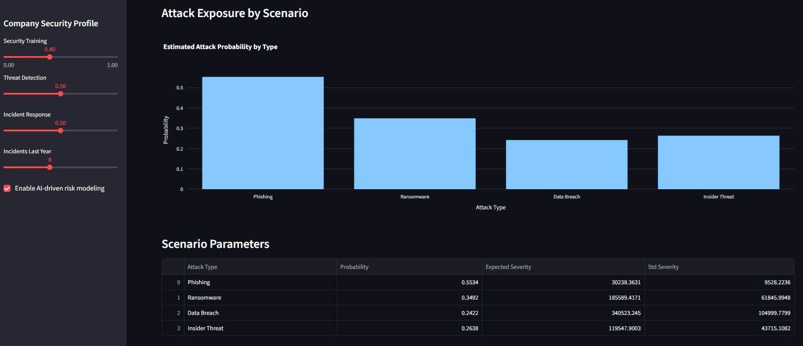
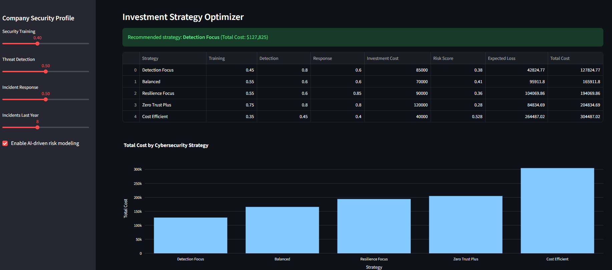
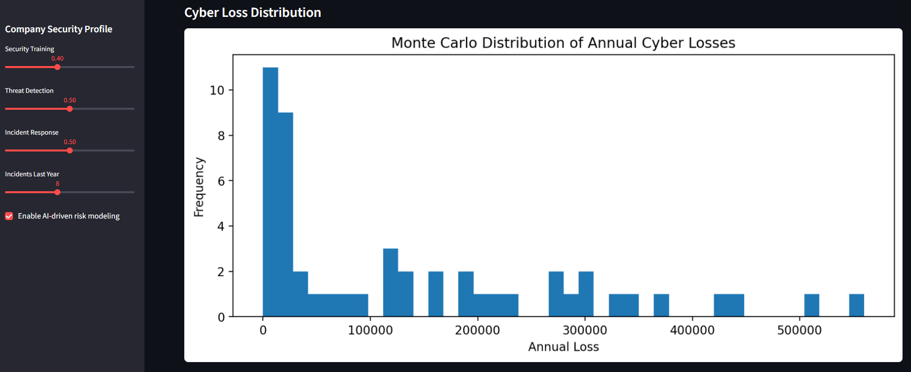
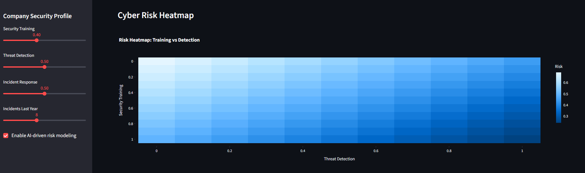

# AI Cyber Risk Simulation Platform

AI Cyber Risk Simulation Platform is an interactive cybersecurity analytics dashboard that combines Monte Carlo modelling with machine learning to model cyber risk exposure and simulates financial losses from cyber attacks. The platform allows users to analyze an organization's cybersecurity posture, estimate potential financial losses, and evaluate cybersecurity investment strategies by simulating realistic attack scenarios.


---

Live demo:

https://ai-cyber-risk-simulation-platform.streamlit.app/

---

## Project Overview

Modern organizations face increasing cyber threats that can lead to significant financial and operational losses. Understanding how different factors influence risk exposure is critical for making informed cybersecurity decisions. This project provides an interactive platform for exploring cyber risk scenarios, simulating potential attack outcomes, and evaluating the impact of different security strategies. The system combines probabilistic modelling (Monte Carlo simulation), machine learning, and data visualization to estimate risk levels and potential losses, supporting more data-driven cybersecurity decision-making.


- **AI-Enhanced Analysis**
  - Incorporates a machine learning model (Random Forest)
  - Provides more data-driven risk estimation and refined predictions


- **Standard Simulation**
  - Uses predefined logic and probabilistic modelling (Monte Carlo)
  - Estimates risk and financial impact based on input parameters


---

## Key Features

- ML-based risk prediction (Random Forest)
- Monte Carlo simulation for cyber incident modelling
- Probabilistic financial loss estimation
- Risk metrics: VaR and CVaR
- Scenario-based risk analysis
- Interactive data visualization (Streamlit)

---

## Live Application

You can explore the interactive dashboard here:

https://ai-cyber-risk-simulation-platform.streamlit.app/

The web application allows users to simulate cyber risk scenarios and visualize the potential financial impact of cyber attacks.

---

## How the Platform Works

The platform evaluates an organization's cybersecurity posture based on a set of key input parameters:

- **Security Training**  
  Reflects employee awareness and preparedness for cyber threats.

- **Threat Detection**  
  Represents the organization's ability to identify threats (e.g. SIEM, SOC, EDR/XDR).

- **Incident Response**  
  Measures how effectively the organization can respond to and contain incidents.

- **Historical Incidents**  
  Captures the number of past cybersecurity incidents.

These inputs are used to:

1. Estimate a cyber risk score using a machine learning model  
2. Simulate potential attack scenarios using Monte Carlo methods  
3. Calculate the distribution of possible financial losses  
4. Derive risk metrics such as VaR and CVaR  

The results are presented in an interactive dashboard, enabling users to explore how different factors influence risk and potential impact.






---

## Cyber Risk Modeling

The system computes a cyber risk score between 0 and 1.

Risk score interpretation:

0.00 – 0.33 → Low cyber risk  
0.33 – 0.66 → Medium cyber risk  
0.66 – 1.00 → High cyber risk

---

## Monte Carlo Simulation

The platform runs thousands of simulated cyber attack scenarios to model uncertainty and potential outcomes.

Simulated attack types include:

- Phishing  
- Ransomware  
- Data breaches  
- Insider threats  

Each simulation generates a potential financial loss, which is then used to estimate:

- **Expected Annual Loss (EAL)**  
- **Value at Risk (VaR)**  
- **Conditional Value at Risk (CVaR)**  

These metrics are widely used in financial risk analysis to quantify uncertainty and downside risk.



---

### Available Visualizations

- **Risk Gauge**  
  Displays the overall cyber risk level (low, medium, high).

- **Loss Distribution**  
  Shows the probability distribution of simulated financial losses.

- **Cyber Risk Heatmap**  
  Illustrates how factors such as security training and threat detection influence risk levels.

- **Attack Exposure**  
  Displays estimated probabilities and impact of different cyber attack scenarios.

- **Strategy Comparison**  
  Compares different cybersecurity strategies and their impact on expected losses.

The dashboard enables users to explore how changes in security posture affect risk, uncertainty, and potential financial outcomes.





---

## Technologies Used

Python  
Streamlit  
NumPy
Scikit-learn 
Plotly  
Monte Carlo Simulation  
Cyber Risk Modeling  

---

## Project Workflow

1. **User Input** – define security parameters  
2. **Risk Estimation** – ML-based or rule-based scoring  
3. **Simulation** – Monte Carlo attack scenarios  
4. **Loss Modeling** – generate financial loss distribution  
5. **Risk Metrics** – calculate EAL, VaR, CVaR  
6. **Visualization** – interactive dashboard (Streamlit)  
7. **Strategy Comparison** – evaluate different security decisions

---

## Project Structure

```
ai-cyber-risk-simulation
|
├── app.py
│   Main Streamlit dashboard application
|
├── risk_model.py
│   Cyber risk scoring model
|
├── attack_simulation.py
│   Monte Carlo simulation engine for cyber incidents
|
├── ml_risk_model.py
|   Machine Learning model (training and loading)
|
├── ml_model.pkl
|   Trained machine learning model (Random Forest) used for risk prediction
|
├── train_model.py
|   Training pipeline for the ML model (data processing, model training, and persistence)
|
├── optimizer.py
│   Cybersecurity strategy evaluation and optimization
|
├── requirements.txt
│   Project dependencies
|
├── README.md
│   Project documentation
|
└── LICENSE
    MIT License
```

---

## Installation

Clone the repository:

```
git clone https://github.com/main5equence/ai-cyber-risk-simulation.git
```

Navigate to the project directory:
```
cd ai-cyber-risk-simulation
```

Install dependencies:
```
pip install -r requirements.txt
```

Run the application locally:
```
streamlit run app.py
```

The dashboard will be available at:

http://localhost:8501


---

## Use Cases

- **Cybersecurity risk analysis**  
  Assess potential risk levels and financial impact of cyber threats.

- **Cybersecurity investment planning**  
  Evaluate how different security measures influence risk and expected losses.

- **Security posture evaluation**  
  Analyze how factors like training, detection, and response affect overall risk.

- **Cyber risk modelling research**  
  Experiment with probabilistic simulations and ML-based risk estimation.

- **Educational simulations**  
  Demonstrate cybersecurity risk concepts in an interactive and visual way.

---

## License

This project is licensed under the MIT License.

