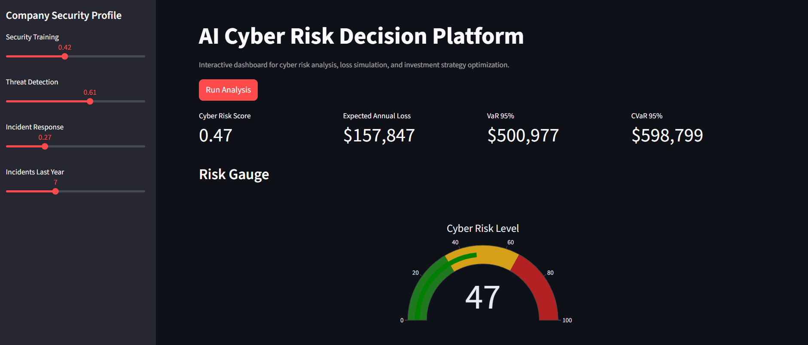
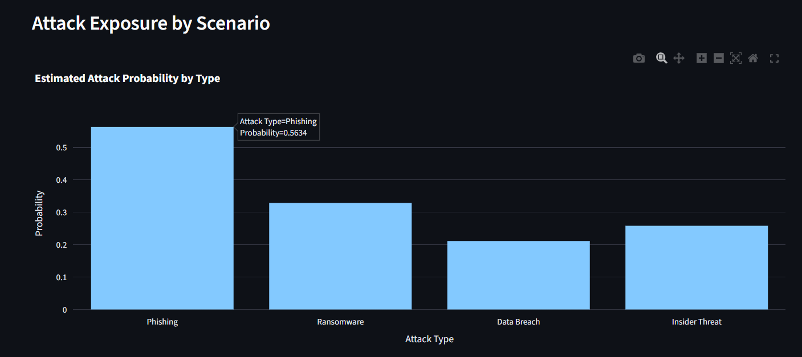
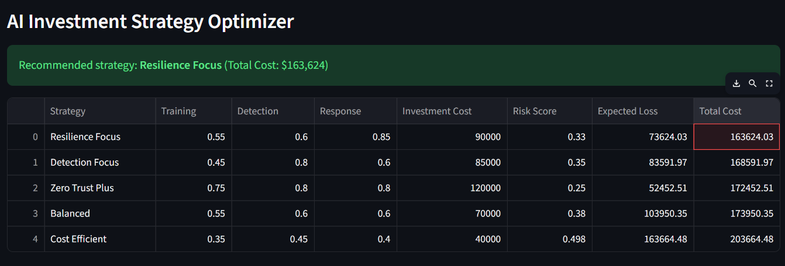
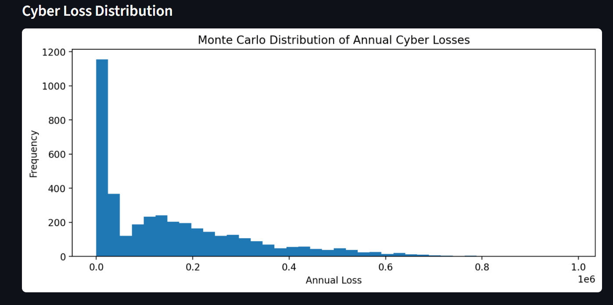
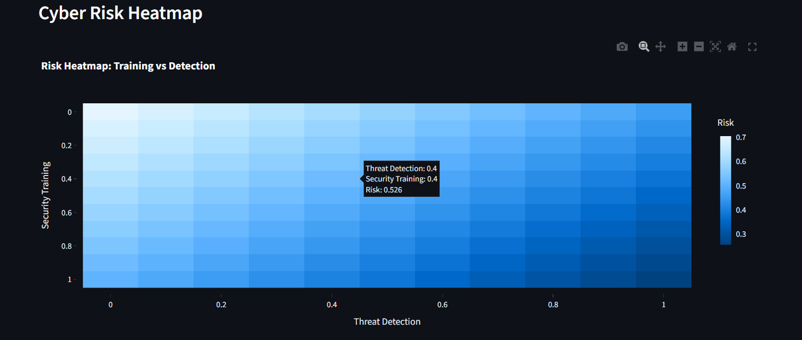
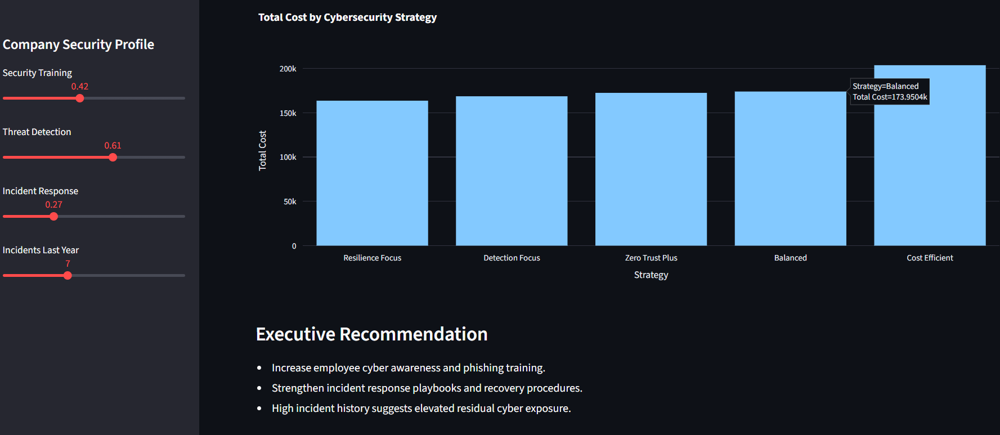

# AI Cyber Risk Simulation Platform

AI Cyber Risk Simulation Platform is an interactive cybersecurity analytics dashboard that models cyber risk exposure and simulates financial losses from cyber attacks.
The platform allows users to analyze an organization's cybersecurity posture, estimate potential financial losses, and evaluate cybersecurity investment strategies using Monte Carlo simulation and interactive visualizations.

Live demo:

https://ai-cyber-risk-simulation-platform.streamlit.app/

---

## Project Overview

Modern organizations face increasing cyber threats that can cause significant financial and operational damage. Decision-makers must evaluate how cybersecurity investments influence risk exposure and potential losses.

This project provides an interactive decision-support platform that allows users to explore cyber risk scenarios, simulate cyber incidents, and evaluate cybersecurity strategies.

The platform combines cyber risk modeling, Monte Carlo simulations, and data visualization to support cybersecurity decision-making.



---

## Key Features

- Cyber risk scoring model
- Monte Carlo simulation of cyber incidents
- Financial loss estimation
- Value at Risk (VaR) and Conditional Value at Risk (CVaR)
- Cyber risk heatmap visualization
- Attack scenario probability analysis
- Cybersecurity investment strategy optimization
- Interactive dashboard built with Streamlit

---

## Live Application

You can explore the interactive dashboard here:

https://ai-cyber-risk-simulation-platform.streamlit.app/

The web application allows users to simulate cyber risk scenarios and visualize the potential financial impact of cyber attacks.

---

## How the Platform Works

The platform evaluates an organization's cybersecurity posture based on several parameters:

- Security Training  
Represents employee cybersecurity awareness and training level.

- Threat Detection  
Represents the organization's ability to detect cyber threats (SIEM, SOC monitoring, EDR/XDR systems).

- Incident Response  
Represents how efficiently the organization can respond to cyber incidents.

- Historical Incidents  
Represents the number of cybersecurity incidents experienced in the previous year.

These parameters are used to calculate a normalized cyber risk score.





---

## Cyber Risk Modeling

The system computes a cyber risk score between 0 and 1.

Risk score interpretation:

0.00 – 0.33 → Low cyber risk  
0.33 – 0.66 → Medium cyber risk  
0.66 – 1.00 → High cyber risk

---

## Monte Carlo Simulation

The platform performs thousands of simulated cyber attack scenarios.

The simulation includes multiple types of cyber attacks:

- Phishing
- Ransomware
- Data breaches
- Insider threats

Each simulation generates potential financial losses, allowing the system to estimate:

- Expected Annual Loss
- Value at Risk (VaR)
- Conditional Value at Risk (CVaR)

These metrics are commonly used in financial risk analysis.




---

## Visualization Dashboard

The dashboard includes several interactive visualizations.

- Risk Gauge  
Displays the overall cyber risk level.

- Loss Distribution  
Shows the probability distribution of potential financial losses.

- Cyber Risk Heatmap  
Illustrates how security training and threat detection influence cyber risk.

- Attack Exposure  
Shows estimated probabilities of different cyber attack scenarios.

- Strategy Optimization  
Compares cybersecurity investment strategies and recommends the option that minimizes total expected cost.






---

## Technologies Used

Python  
Streamlit  
NumPy  
Plotly  
Monte Carlo Simulation  
Cyber Risk Modeling  

---

## Project Workflow

User Security Profile → Cyber Risk Model → Monte Carlo Simulation → Risk Metrics Calculation → Interactive Streamlit Dashboard → Strategy Optimization

---

## Project Structure

```
ai-cyber-risk-simulation
|
├── app.py
│   Main Streamlit dashboard application
|
├── risk_model.py
│   Cyber risk scoring model
|
├── attack_simulation.py
│   Monte Carlo simulation engine for cyber incidents
|
├── optimizer.py
│   Cybersecurity strategy evaluation and optimization
|
├── requirements.txt
│   Project dependencies
|
├── README.md
│   Project documentation
|
└── LICENSE
    MIT License
```

---

## Installation

Clone the repository:

```
git clone https://github.com/main5equence/ai-cyber-risk-simulation.git
```

Navigate to the project directory:
```
cd ai-cyber-risk-simulation
```

Install dependencies:
```
pip install -r requirements.txt
```

Run the application locally:
```
streamlit run app.py
```

The dashboard will be available at:

http://localhost:8501


---

## Use Cases

Cybersecurity risk analysis  
Cybersecurity investment planning  
Security posture evaluation  
Cyber risk modeling research  
Educational cybersecurity simulations  

---

## License

This project is licensed under the MIT License.

